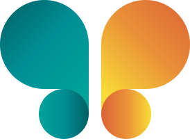

# Migam Style Guide

> **For AI agents.** Drop this file into the context of any agent building Migam internal
> apps, tools, landing pages, or presentations. It encodes the visual language extracted
> from **migam.org** (homepage + subpages: o-migam, cennik, branże, dla-głuchych,
> tłumaczenia-pjm, kontakt, certyfikacja, badania-rozwój — June 2026) so generated work
> looks unmistakably like Migam. The system is consistent across all pages; subpages added
> the semantic/form colors and the extended teal-tint ramp documented below.
>
> **How to use:** Treat the tokens in §2 as the single source of truth. Never invent new
> brand colors or fonts. When in doubt, prefer teal `#0F6B68`, the Figtree/Hanken Grotesk
> pairing, pill-shaped buttons, and generous rounded cards on soft mint backgrounds.

---

## 1. Brand at a glance

Migam provides Polish Sign Language (PJM) interpreting and AI signing avatars for
businesses and public institutions. The brand feels **trustworthy, warm, human, and
accessible** — never clinical or corporate-cold. Visual signature:

- **Deep teal** as the dominant brand color, on **white** and **soft mint** backgrounds.
- A **warm orange** accent reserved for primary calls-to-action.
- Rounded everything: **pill-shaped buttons**, soft **rounded cards**, gentle teal-tinted shadows.
- Confident sans-serif type: **Figtree** for headings, **Hanken Grotesk** for body.
- Tone of voice: **direct, second-person, benefit-first, plain Polish.**

Accessibility is the product *and* the design ethic — always meet WCAG AA contrast, respect
`prefers-reduced-motion`, and write descriptive `alt` text (the real site does both).

### 1.1 Logo mark

The Migam mark ships next to this guide as **[`logo-migam-icon.svg`](./logo-migam-icon.svg)**
— two rounded hook forms with dots, teal on the left, amber→orange on the right.
`viewBox="0 0 274 200"`, gradient-filled, already carries `role="img"` + `aria-label="Migam"`.

**Always use the file.** Never redraw the mark, rebuild it from tokens, or approximate it
with shapes — reference or inline the SVG.

```html
<!-- standalone / meaningful (e.g. header link, slide title) -->


<!-- decorative — next to the word "Migam" in text, so the alt would be a duplicate -->

```

**Logo-only colors.** The mark carries its own gradients. They are **not** palette tokens —
never pull them into UI, charts, text, or backgrounds. Brand UI stays on `#0F6B68`.

| Part | Gradient | Direction |
|---|---|---|
| Teal hook | `#046369` → `#03A5A9` | diagonal, top-left → bottom-right |
| Teal dot | `#01ABAA` → `#06656E` | horizontal, left → right |
| Amber hook | `#F3BF3A` → `#DB5B37` | diagonal, bottom-left → top-right |
| Amber dot | `#DA5837` → `#F7D03B` | horizontal, left → right |

**Placement rules**

- **Clear space:** keep free space equal to a dot radius (`36` viewBox units ≈ 13% of the
  logo's width) on all four sides. Nothing — text, edges, rules — crosses it.
- **Minimum size:** `24px` tall on screen, `8mm` in print. The dots stop reading below that.
- **Backgrounds:** white, `--surface-mint-50/100`, or the dark teal hero gradient — the mark
  holds on all three. On photos or busy fills, set it on a white pill/card first.
- **Scaling:** set one dimension and let the other follow (`height:auto`); the `viewBox`
  preserves the ratio. Never stretch to fit a box.
- **Slides:** PowerPoint and Keynote take the SVG directly. Google Slides doesn't — export a
  PNG from the style book page (`⬇ PNG` button in the Logo section) and place that.

**Don't**

- Don't recolor the mark — no flat teal, no white/black knockout, no inverted variant.
- Don't add shadows, glows, strokes, or filters to it.
- Don't rotate, skew, stretch, crop, or rearrange the two halves.
- Don't place it on orange, or mint-on-mint where the teal half loses contrast.
- Don't use the mark as a bullet, divider, texture, or inline-in-body-text glyph.
- Don't pair it with a hand-set "migam" wordmark — if you need a lockup, ask brand first.

### 1.2 Favicons & app icons

A generated set lives in **[`migam-favicons/`](./migam-favicons/)** — use it as-is for any
Migam web app, tool, or hosted deck. Don't regenerate icons by hand.

| File | Size | Background | Where it's used |
|---|---|---|---|
| `favicon.svg` | square, `viewBox="0 -37 274 274"` | transparent | Modern browsers — scales to any tab size. |
| `favicon.ico` | 16 / 32 / 48 | transparent | Legacy browsers, Windows shortcuts. |
| `apple-touch-icon.png` | 180×180 | **white** | iOS home screen. Opaque on purpose — iOS renders transparency as black. |
| `icon-192.png`, `icon-512.png` | 192, 512 | transparent | PWA / Android, `purpose: any`. |
| `icon-512-maskable.png` | 512 | **white** | Android adaptive icon, `purpose: maskable`. Mark sits inside the 80% safe circle. |
| `site.webmanifest` | — | — | PWA manifest. `theme_color` is brand teal `#0F6B68`, not a logo gradient. |

The square favicon is the **one sanctioned reframing** of the mark: the viewBox gains 37
units top and bottom to square the 274×200 artwork. Nothing is recolored, moved, or rescaled.
Don't invent other crops.

**Deployment:** `site.webmanifest` references its icons with root-absolute paths
(`/icon-192.png`), so the icon files must be copied to the **web root** — not left in a
subfolder. If your app is served from a sub-path, rewrite those `src` values to match, or
the manifest icons 404 silently.

```html
<link rel="icon" href="/favicon.ico" sizes="32x32">
<link rel="icon" href="/favicon.svg" type="image/svg+xml">
<link rel="apple-touch-icon" href="/apple-touch-icon.png">
<link rel="manifest" href="/site.webmanifest">
<meta name="theme-color" content="#0F6B68">
```

Keep `theme-color` in the markup and in the manifest identical, and keep both on brand teal
— that value paints browser and Android UI chrome, so the logo-only gradients don't belong there.

---

## 2. Design tokens

### 2.1 Color palette

**Brand & core**

| Token | Hex | Role |
|---|---|---|
| `--migam-teal` | `#0F6B68` | **Primary brand color.** Buttons, links, icons, accents. The default "Migam color." |
| `--migam-teal-deep` | `#0B3534` | Darkest teal. Gradient end, deep backgrounds, heavy shadows (tint). |
| `--migam-teal-700` | `#0A514F` | Hover/pressed state for teal surfaces. |
| `--migam-teal-bright` | `#178783` | Brighter teal — logo mark, small icons. |
| `--migam-mint` | `#6BC4BB` | Soft aqua accent — highlights, illustrations, decorative dots. |
| `--ink` | `#1C1C1C` | Primary text & dark buttons. Near-black, never pure `#000`. |
| `--ink-soft` | `#424D4F` | Strong secondary text (cooler than `--muted`). Site-wide on subpages. |
| `--muted` | `#5A6567` | Secondary / supporting text, captions, metadata. |
| `--muted-cool` | `#5F6B6D` | Muted text variant used across subpages. Interchangeable with `--muted`. |
| `--white` | `#FFFFFF` | Page background, text on dark/teal surfaces. |

> **Text ramp:** primary `#1C1C1C` → strong-secondary `#424D4F` → muted `#5A6567`/`#5F6B6D`.
> Pick by emphasis; don't go lighter than the muted greys for body-sized text.

**Semantic / state** (for forms, alerts, status — observed on the contact form & status dots)

| Token | Hex | Role |
|---|---|---|
| `--error` | `#B3261E` | Form validation errors, required-field markers (`*`). Weight 600. |
| `--success` | `#2E9E63` | Positive status / "available" dots and pills. |

> Semantic colors are **separate from the brand accent** — never substitute orange for an
> error/success state, and never use error-red as decoration.

**Accent (use sparingly — CTAs only)**

| Token | Hex | Role |
|---|---|---|
| `--accent-orange` | `#EE7F2B` | **Primary CTA** background and attention badges. The one "act now" color. |
| `--accent-orange-dark` | `#D96E1D` | Orange hover/pressed. |
| `--accent-amber` | `#E8A33D` | Warm secondary accent / highlight. |
| `--on-orange` | `#2B1503` | Text color **on** orange (dark brown, not white — this is intentional). |

**Tints & surfaces** (teal washed into near-whites — used for section backgrounds & cards)

| Token | Hex | Role |
|---|---|---|
| `--surface-mint-50` | `#F1F7F6` | Lightest mint — alternating section background. |
| `--surface-mint-100` | `#E7F3F2` | Card / panel background. |
| `--surface-mint-200` | `#E2EDEB` | Soft fill, hover wash. |
| `--surface-mint-300` | `#D7E6E4` | Deeper wash / nested panels. |
| `--border-mint` | `#C2D4D1` | Hairline borders on mint surfaces. |
| `--border-mint-soft` | `#BFDEDB` | Subtle pill / chip borders. |
| `--teal-tint-300` | `#A9C9C5` | Mid teal-grey — dividers, muted icons. |
| `--teal-tint-400` | `#7FA39E` | Muted teal text / inactive icons on light. |

> The teal tint ramp runs light→dark: `F1F7F6 · E7F3F2 · E2EDEB · D7E6E4 · C2D4D1 · A9C9C5 · 7FA39E`.
> Use the light end for backgrounds, the middle for borders, the dark end for muted teal accents.

> **Rule:** Orange is the *only* warm accent and is reserved for the single most important
> action on a screen. Everything else lives in the teal/mint/ink family. Do not use orange
> for body text, links, or decorative fills.

> **Not brand colors:** the homepage also contains flag colors (`#C8102E`, `#012169`,
> `#0057B7`, `#FFD700`, `#11457E`, …) used only in the **language selector**. Ignore these
> for app/presentation design.

### 2.2 Typography

```
Headings / UI labels : 'Figtree', sans-serif         weights 600, 700, 800
Body / paragraphs    : 'Hanken Grotesk', sans-serif  weights 400, 500, 600, 700
```

Google Fonts import (latin-ext subset — keeps Polish diacritics crisp):

```html
<link rel="preconnect" href="https://fonts.googleapis.com">
<link rel="preconnect" href="https://fonts.gstatic.com" crossorigin>
<link href="https://fonts.googleapis.com/css2?family=Figtree:wght@600;700;800&family=Hanken+Grotesk:wght@400;500;600;700&display=swap&subset=latin-ext" rel="stylesheet">
```

**Type scale** (observed sizes, rounded into a usable ramp):

| Use | Size | Font / weight | Notes |
|---|---|---|---|
| Hero / page title | 44–56px | Figtree 800 | `letter-spacing: -0.015em` (tighten big type) |
| Section heading (H2) | 34–40px | Figtree 800 | |
| Subsection (H3) | 22–28px | Figtree 700 | |
| Lead / large body | 17–21px | Hanken Grotesk 500 | |
| Body | 15–16px | Hanken Grotesk 400 | base size **15px** |
| Small / caption | 13–14px | Hanken Grotesk 500 | `--muted` color |
| Eyebrow / pill label | 12.5–13.5px | Figtree 700 | `UPPERCASE`, `letter-spacing: 0.06em` |

Rules of thumb:
- Big display headings get **negative** tracking (`-0.01em` to `-0.015em`).
- Small uppercase eyebrows/badges get **positive** tracking (`0.06em`–`0.08em`).
- Default body weight is 400; bump to 700 for emphasis (skip italics for emphasis).

### 2.3 Radius, shadow, spacing

```css
/* Border radius */
--radius-pill:   999px;  /* buttons, chips, badges — the signature shape */
--radius-card:   22px;   /* large cards / hero panels */
--radius-md:     18px;   /* standard cards */
--radius-sm:     12px;   /* inputs, small tiles, images */

/* Shadows — always tinted with deep teal, never neutral gray */
--shadow-sm:  0 10px 30px rgba(11,53,52,0.10);
--shadow-md:  0 18px 48px rgba(11,53,52,0.14);
--shadow-lg:  0 24px 60px rgba(11,53,52,0.18);
--shadow-hairline: 0 0 0 1px rgba(0,0,0,0.08);  /* crisp 1px ring */

/* CTA glow (orange buttons only) */
--shadow-cta: 0 14px 38px rgba(238,127,43,0.45);

/* Spacing — 4px base grid */
--space-1: 4px;  --space-2: 8px;  --space-3: 12px;  --space-4: 16px;
--space-5: 22px; --space-6: 30px; --space-8: 48px;  --space-10: 64px;
```

Buttons pad roughly `13–16px` vertical × `30px` horizontal. Cards pad `22–30px`.

### 2.4 Gradients

```css
/* Hero / dark teal panels */
background: linear-gradient(135deg, #0F6B68 0%, #0B3534 100%);

/* Soft section fade into white */
background: linear-gradient(180deg, #F1F7F6 0%, #FFFFFF 100%);
```

---

## 3. Components (copy-paste patterns)

These mirror the real site's inline styles. Use them as the canonical look.

### 3.1 Primary CTA button (orange)
```html
<a style="display:inline-block; padding:15px 30px; border-radius:999px;
          background:#EE7F2B; color:#2B1503; font-family:'Figtree',sans-serif;
          font-weight:700; font-size:16px;">Umów rozmowę</a>
```

### 3.2 Brand button (teal)
```html
<a style="display:inline-flex; align-items:center; gap:9px; padding:11px 18px;
          border-radius:999px; background:#0F6B68; color:#FFFFFF;
          font-weight:700; font-size:15px;">Połącz z tłumaczem</a>
```

### 3.3 Outline / secondary button
```html
<a style="padding:11px 18px; border-radius:999px; border:2px solid #1C1C1C;
          color:#1C1C1C; font-weight:700; font-size:15px;">Dowiedz się więcej</a>
```

### 3.4 Dark button
```html
<a style="padding:16px 30px; border-radius:999px; background:#1C1C1C;
          color:#FFFFFF; font-weight:700; font-size:16.5px;">Kontakt</a>
```

### 3.5 Eyebrow pill / chip
```html
<span style="display:inline-flex; align-items:center; gap:8px; padding:7px 14px;
             border-radius:999px; background:#FFFFFF; border:1.5px solid #BFDEDB;
             color:#0F6B68; font-family:'Figtree',sans-serif; font-size:13.5px;
             font-weight:700; letter-spacing:0.04em; text-transform:uppercase;">Nowość</span>
```

### 3.6 Card on mint surface
```html
<div style="background:#FFFFFF; border:1px solid #C2D4D1; border-radius:22px;
            padding:30px; box-shadow:0 10px 30px rgba(11,53,52,0.10);">
  <h3 style="font-family:'Figtree',sans-serif; font-weight:800; font-size:22px;
             color:#1C1C1C; margin:0 0 10px;">Tytuł karty</h3>
  <p style="font-family:'Hanken Grotesk',sans-serif; font-size:15px; color:#5A6567;
            margin:0; line-height:1.6;">Treść opisowa karty.</p>
</div>
```

### 3.7 "Attention" badge (floating on a card corner)
```html
<span style="position:absolute; top:-13px; left:30px; background:#EE7F2B;
             color:#2B1503; font-size:12.5px; font-weight:700; letter-spacing:0.06em;
             text-transform:uppercase; border-radius:999px; padding:5px 14px;">Promocja</span>
```

### 3.8 Form field + validation (from the contact form)
```html
<label style="font-family:'Figtree',sans-serif; font-weight:700; font-size:14px;
              color:#1C1C1C;">Imię i nazwisko <span aria-hidden="true" style="color:#B3261E;">*</span></label>
<input style="width:100%; margin-top:6px; padding:13px 16px; border-radius:12px;
              border:1.5px solid #C2D4D1; background:#FFFFFF; font-family:'Hanken Grotesk',sans-serif;
              font-size:15px; color:#1C1C1C;">
<!-- focus: border-color:#0F6B68; outline:3px solid rgba(15,107,104,.25) -->
<div role="alert" style="color:#B3261E; font-weight:600; font-size:13px; margin-top:5px;">Podaj imię i nazwisko.</div>
```

### 3.9 Status dot (success / availability)
```html
<span style="display:inline-flex; align-items:center; gap:8px; font-size:14px; color:#424D4F;">
  <span style="width:10px; height:10px; border-radius:999px; background:#2E9E63;"></span> Dostępny teraz
</span>
```

---

## 4. Voice & tone (for copy in apps & slides)

Extracted from real Migam headlines — match this register when writing UI copy or
presentation text.

- **Speak to "you" (Ty/Twój), directly.** *"Otwórz się na Głuchych klientów. Dziś, nie kiedyś."*
- **Lead with the benefit / the human outcome,** not the feature.
- **Short, confident, declarative sentences.** Often a punchy second clause: *"Dziś, nie kiedyś."*
- **Concrete numbers build trust:** *"200 000+ rozmów", "45 tysięcy punktów w całej Polsce", "1 765 organizacji."*
- **Plain Polish, no jargon.** Accessibility framed as opportunity + obligation, never pity.
- **Capitalize "Głuchy/Głuchych"** when referring to the Deaf community (cultural identity) —
  this is intentional and respectful; keep it.
- Default language is **Polish**. For internal tooling, write copy in Polish unless told otherwise.

**Examples of on-brand headlines:**
> Jeden tłumacz, wszędzie tam, gdzie jest Twój klient
> Awatary AI, które tłumaczą na język migowy
> Prosty abonament. Zero ukrytych kosztów.
> Masz pytania? Odpowiadamy.

---

## 5. Do / Don't

**Do**
- Use teal `#0F6B68` as the default brand color and white/mint as backgrounds.
- Use the shipped `logo-migam-icon.svg` as-is, with its clear space (see §1.1).
- Reserve orange `#EE7F2B` for the single primary action; pair it with dark text `#2B1503`.
- Make buttons fully pill-shaped (`border-radius:999px`).
- Use teal-tinted shadows, never gray ones.
- Pair Figtree (headings) with Hanken Grotesk (body); load the latin-ext subset.
- Write descriptive, human `alt` text and respect `prefers-reduced-motion`.
- Keep generous whitespace, large rounded cards, and clear hierarchy.

**Don't**
- Don't use pure black `#000000` for text — use ink `#1C1C1C`.
- Don't redraw, recolor, or restyle the logo — and don't reuse its gradients as UI colors.
- Don't use orange for links, body text, or decorative fills.
- Don't introduce off-brand accent colors (flag colors are for the language switcher only).
- Don't use sharp 0px corners on buttons or cards.
- Don't put white text on orange — orange uses dark-brown text.
- Don't mix in other fonts; stick to the two-family system.
- Don't use pity-framed or clinical language about Deaf users.

---

## 6. Machine-readable tokens

A JSON token file (`migam-tokens.json`) and a CSS variables file (`migam-tokens.css`) sit
next to this guide for direct import into apps or build pipelines. The logo mark sits there
too, as `logo-migam-icon.svg` — the JSON carries its metadata under `logo` (file name,
`viewBox`, clear space, minimum size, and its logo-only gradients). The gradients are
deliberately **absent from `migam-tokens.css`** so they can't leak into UI code.
